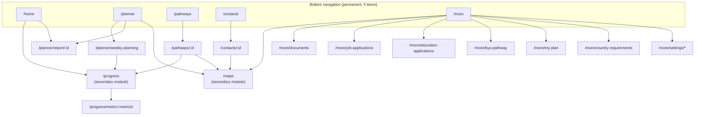

# Navigation Contract

**Status: Confirmed and fixed.** The five-item bottom navigation is permanent. Adding a sixth tab,
promoting Maps or Progress to a tab, or moving a listed feature between destinations is a contract
change requiring the repository owner's approval and an ADR — not a routing tweak.

---

## 1. Permanent bottom navigation

| # | Tab | Route | Role |
| --- | --- | --- | --- |
| 1 | **Home** | `/home` | Daily command center — what needs attention today |
| 2 | **Planner** | `/planner` | Time and task management — day, week, month, tasks, weekly planning |
| 3 | **Pathways** | `/pathways` | Long-term life areas and their milestones |
| 4 | **Contacts** | `/contacts` | Relationships and follow-ups |
| 5 | **More** | `/more` | Secondary features and system controls |

Five items exactly. Icon plus label always visible. Selected state uses the dusty-rose accent; unselected
uses secondary text. Each tab preserves its own navigation stack across tab switches. Re-tapping the
active tab pops that tab's stack to its root.

## 2. Secondary modules — full modules, not tabs

### Maps and Places

A full module (`/maps`), reachable from multiple parents. It is never a bottom-navigation item.
Entry points:

| From | Trigger | Opens |
| --- | --- | --- |
| Contacts | contact address / "Directions" | `/maps?focus=contact:<id>` |
| Planner | event location on an activity | `/maps?focus=event:<id>` |
| Pathways | office or campus tied to a milestone | `/maps?focus=place:<id>` |
| More | *Maps and Places* row | `/maps` |
| Any event location chip | tap | `/maps?focus=event:<id>` |

Maps always opens as a pushed route over the invoking tab's stack and returns to it. It does not reset
the tab. Saved places are a first-class entity (`saved_places`) reusable by events, contacts, and
requirements.

### Progress

Progress is **not** a bottom-navigation item and has no tab. It is opened from context, so a number is
always explained from the place the user doubted it:

| From | Trigger | Opens |
| --- | --- | --- |
| Home | a Weekly Key Indicator card | `/progress/metric/<metricId>` |
| Home | *View All Progress* | `/progress` |
| Planner | Weekly Planning Review step | `/progress?week=<weekStart>` |
| Pathways | pathway detail progress panel | `/progress?pathway=<pathwayId>` |
| Progress | indicator detail row | `/progress/metric/<metricId>` |

Every Progress surface is read-only for actuals. Editing a goal from a Progress screen opens a goal
editor, which writes `weekly_metric_targets` — never an actual.

## 3. Destination responsibilities

### Home — `/home`

The daily command center. Ordered by urgency, not by feature.

1. Today's activities (timeline preview with outcome state)
2. Tasks due today
3. Overdue actions
4. **Activities awaiting outcome report** — the reporting funnel; prominent by design
5. Weekly key indicators (goal, actual, scheduled potential, remaining)
6. Active pathway summaries
7. Upcoming deadlines (documents, applications, education dates)
8. Quick-create actions

Home displays; it does not own domain logic. Every card deep-links into the owning module.

### Planner — `/planner`

- Daily timeline (`/planner/day`) — hour-gridded, current day default
- Weekly calendar (`/planner/week`)
- Monthly view (`/planner/month`)
- Tasks (`/planner/tasks`) and unscheduled tasks (`/planner/tasks/unscheduled`)
- Recurring activities (`/planner/recurring`)
- Backup plans (`/planner/backup-plans`)
- Weekly Planning (`/planner/weekly-planning`)
- Activity outcome reporting (bottom sheet `/planner/report/<occurrenceId>`)

### Pathways — `/pathways`

Covenant Path · Employment · Education · Documents and Identification · Financial Self-Reliance ·
Health and Routine · Family and Relationships · Service and Community · user-created pathways.

Detail route `/pathways/<id>`; milestones `/pathways/<id>/milestones/<milestoneId>`. A pathway detail
shows a read-only progress panel and links into Progress for the arithmetic.

### Contacts — `/contacts`

A relationship and follow-up system, not an address book. Categories: family, mission companions,
mission leaders, Church leaders, mentors, recruiters, employers, school contacts, government-office
contacts, friends, professional connections, ministering contacts.

Each contact detail (`/contacts/<id>`) carries next follow-up, last interaction, related pathway,
tasks, appointments, and private notes. Private notes are P1 sensitive — never in diagnostics, manual
conflict resolution on sync.

### More — `/more`

Grouped exactly as follows.

**Planning and records** — Maps and Places · Documents · Job Applications · Education Applications ·
Activity History · Journal

**Programs and resources** — BYU–Pathway · My Plan · My Plan Conference · Self-Reliance Resources ·
Country Requirements · Official Links

**Account and app** — Profile · Country and Language · Notifications · Privacy · Appearance ·
Accessibility · Sync and Backup · Export Data · Help · Feedback · Report a Problem · About

## 4. Route map

## 5. Rules

1. **Five tabs, permanently.** No sixth item, no dynamic tab, no A/B test on tab composition.
2. **Maps and Progress are never tabs.** They are pushed modules with multiple entry points.
3. **Every module is reachable in ≤ 3 taps from a tab root.** A new feature that cannot meet this
   belongs in a More group, not in a new tab.
4. **Deep links resolve to the correct tab stack.** `/progress/metric/x` opened from a notification
   selects Home, then pushes Progress, so Back behaves sensibly.
5. **Destructive and irreversible actions never live in a bottom sheet's primary position.**
6. **Bottom sheets are contextual, single-purpose, and dismissible without side effects.** Outcome
   reporting is a sheet; abandoning it leaves the activity Awaiting Report, never silently resolved.
7. **Actuals are read-only on every screen.** A Progress surface may link to a goal editor; it may
   never edit an actual.
8. **Back exits a module, never the app**, unless the user is at a tab root.
9. **State is preserved per tab** across switches; scroll position and filters survive.
10. **One bottom navigation bar, ever.** Overlapping or duplicated navigation bars from design exports
    are cleanup items, not implementation targets — see
    [`../design/stitch-cleanup-backlog.md`](../design/stitch-cleanup-backlog.md).

## 6. Implementation notes (GoRouter — ADR-0003)

- A `StatefulShellRoute.indexedStack` provides the five branches, each with its own `Navigator` and
  preserved state.
- Secondary modules (`/maps`, `/progress`) are declared **outside** the shell branches and pushed onto
  the active branch, so the bottom bar remains visible and the invoking tab is the return target.
- Outcome reporting and quick-create are `ModalBottomSheetRoute`s carrying the occurrence id in the
  path, so they are deep-linkable from a notification.
- Every route name is a constant in one `routes.dart`. No string literals at call sites.
- Route-level guards: authentication boundary, then onboarding completeness, then country-pack
  selection.

## 7. Acceptance criteria

1. Bottom navigation shows exactly five items in the specified order, on every screen where it is
   visible.
2. Neither Maps nor Progress appears as a bottom-navigation item on any screen.
3. Progress is reachable from all five documented entry points and is read-only for actuals.
4. Maps is reachable from all five documented entry points and returns to the invoking tab.
5. Switching tabs and returning restores the previous stack, scroll position, and filters.
6. A deep link to any documented route restores a correct tab-plus-stack state with working Back.
7. No screen renders two bottom navigation bars.
8. Every More row navigates to a real destination — no dead rows in a shipped build.
